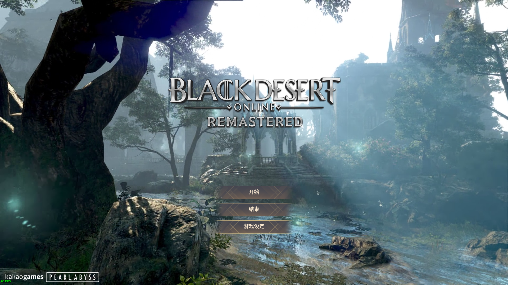

# 黑色沙漠汉化工具客户端
[点击查看汉化补丁效果展示](SHOW_SC.md)
汉化目标是黑色沙漠美服/欧服，但按理其他区域（比如：韩服，日服，大洋，俄服等）应该都能用，但并未测试过。如果有测试过可行的同学可以发个issue或discussion里说一下。

# 使用方法
## 1. 通过客户端打汉化补丁
1. 下载[`bdocn_client.exe`](https://github.com/BDO-CnHope/bdocn_client/raw/main/bdocn_client.exe)
2. 正确的选择黑沙的游戏目录
3. 按指示完成汉化补丁的安装
## 2. 手动安装汉化补丁
1. 前往[黑沙汉化语言包](https://github.com/BDO-CnHope/bdocn)
2. 打包下载`ads`和`prestringtable`这两个文件夹
3. 找到你本地的黑沙的游戏根目录
4. 将下载的两个文件夹覆盖到目录
## 3. 手动编译客户端安装汉化补丁
1. 安装`python`环境
2. 安装`pyinstaller`
3. 下载`https://github.com/BDO-CnHope/bdocn_client/tree/main/src/py`里的文件包
4. 通过终端执行命令`pyinstaller.exe --clean -F -p .\ -i .\logo_og_han.ico .\run.py`
5. 在`dist`下能找到打包好的执行文件
## 4. 使用旧版的客户端
1. 旧版的客户端是使用`powershell`写的，然后打包成exe可执行文件
2. 已不再维护，但应该还能用
3. https://github.com/BDO-CnHope/bdocn_client/tree/main/src/ps

# 注意
- 已在Windows 10 x64上测试过客户端可正常运行，但未测试在其它版本Windows上的兼容性如何。
- 新发布的`python`版（练手版🙈)的汉化客户端可能会被安全软件误报为可疑的执行文件，但可以放心的运行。如果你不放心的话, 请自行斟酌。

# issue
- 如有问题请开issue提问，比如发现有乱码或者显示不正确等问题。

# 声明
- 本软件和代码仅供学习交流，如作他用所承受的法律责任一概与作者无关！

# 相关链接
- [bdocn - Github](https://github.com/BDO-CnHope/bdocn)
- [bdocn - Gitee](https://gitee.com/bdo-cnhope/bdocn)
- [黑沙汉化语言包](https://github.com/BDO-CnHope/bdocn)
- [黑沙汉化工具客户端](https://github.com/BDO-CnHope/bdocn_client)

